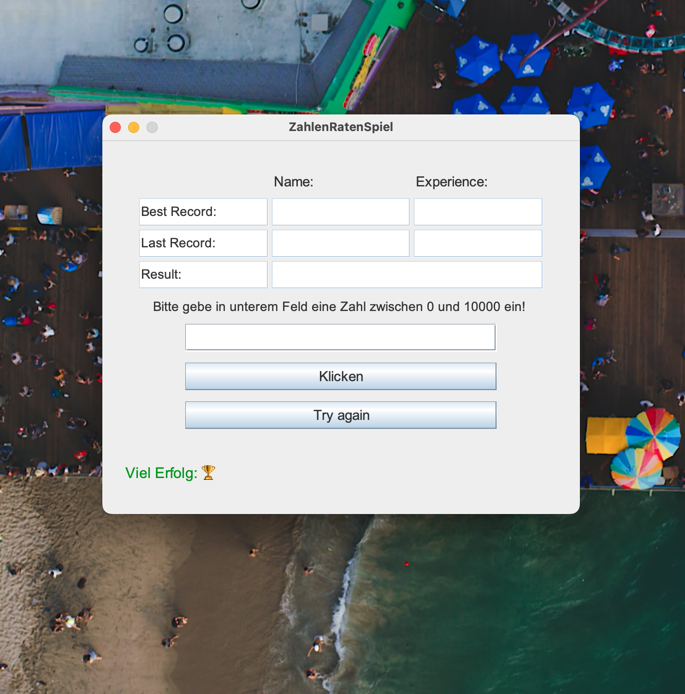
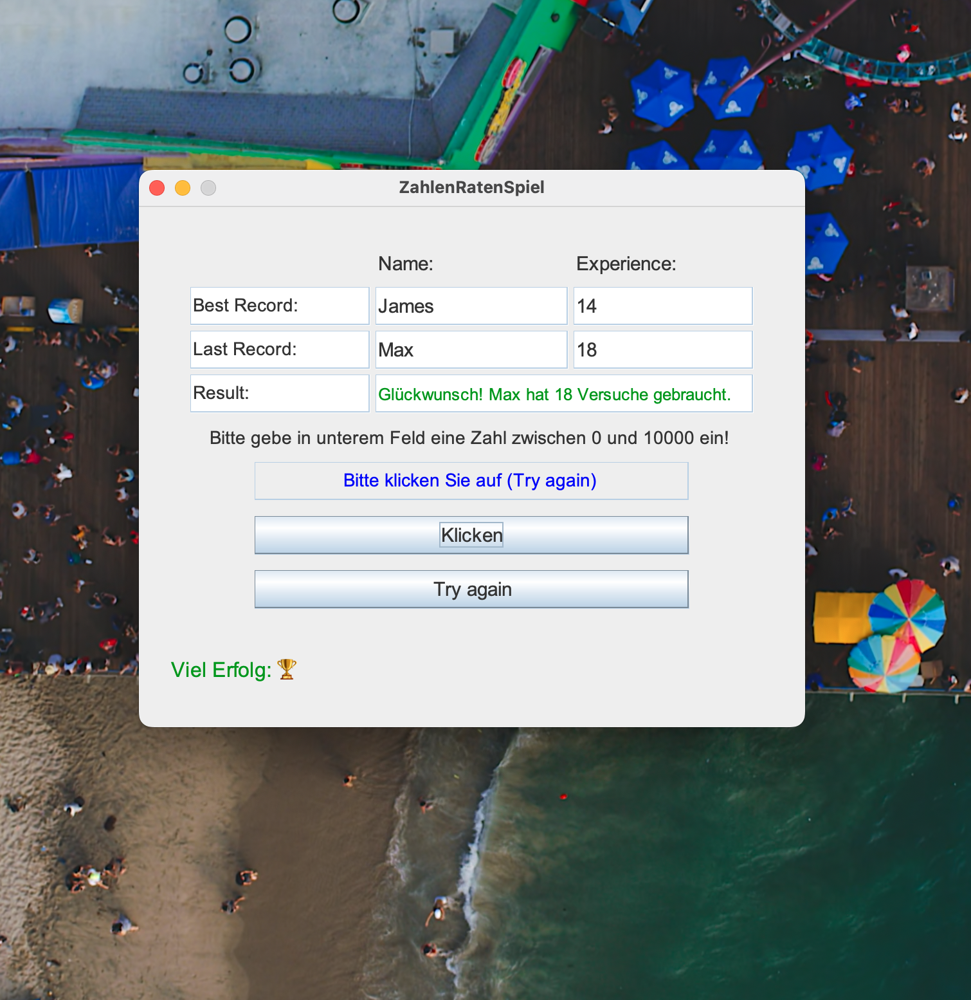
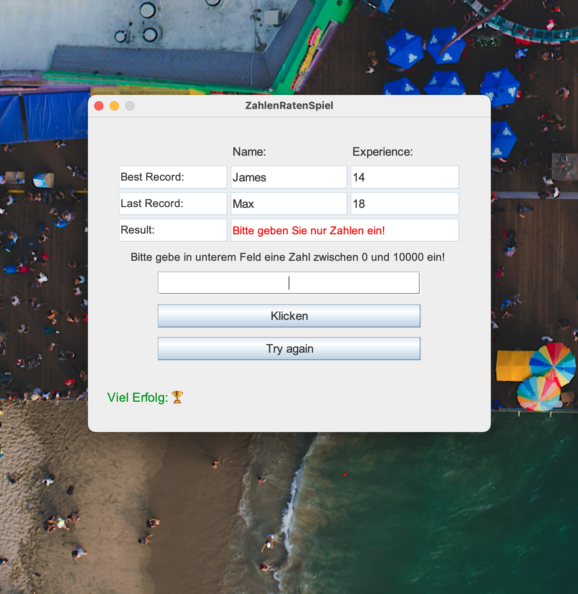
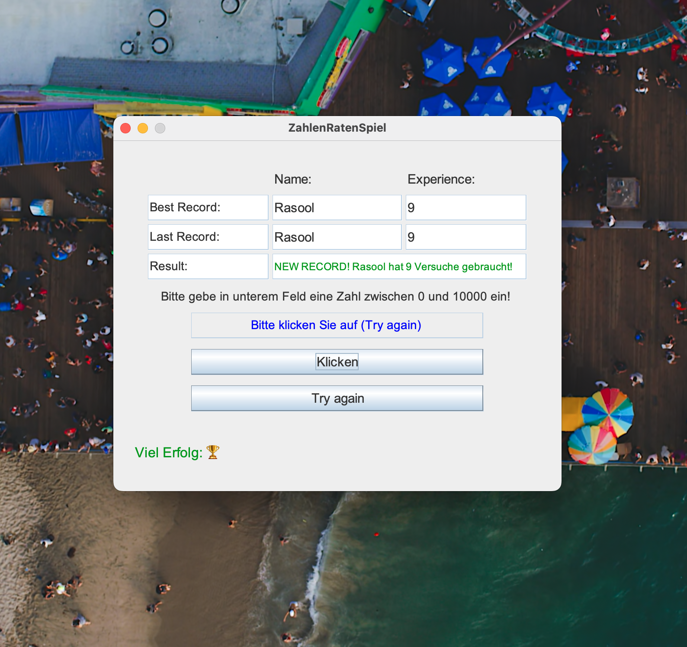

🇩🇪 Deutsch

Ein interaktives Zahlenratespiel mit grafischer Benutzeroberfläche (Swing), das über die reine Spiellogik hinausgeht und moderne Software-Prinzipien anwendet. 
Die Software-Architektur wurde gezielt auf dem anspruchsvollen Niveau eines Informatikstudum (3. Semester) entwickelt, um fortgeschrittenen Programmierkonzepte zu demonstrieren. 

✨ Highlights

• Intelligentes Datenmanagement:
Speichert Bestleistungen, Namen und Zeitstempel in einer lokalen Datei (ergebnisse.txt).
• Auto-Expiration:
Ein innovativer Algorithmus lässt Rekorde automatisch nach 7 Tagen verfallen, um den Wettbewerb aktuell zu halten.
• Robuste Fehlerbehandlung:
Fängt ungültige Eingaben (Buchstaben, Sonderzeichen) sicher ab (try-catch), ohne das Programm zu unterbrechen.
• Optimierte UX:
Professionelle Benutzeroberfläche mit automatischer Zentrierung, fixierter Fenstergröße und flüssigem Workflow.

🛠 Technische Details

• Sprache: Java
• Framework: Swing (GUI)
• Layout: GridBagLayout für eine präzise Anordnung der Komponenten.
• Build-Tool: Maven (pom.xml)
• Version: v1.0 (Stable) 

🇺🇸 English

An interactive number guessing game with a graphical user interface (Swing) that goes beyond simple game logic by implementing modern software principles. 
This project was developed to match the hight standarts of 3rd-semester copmuter science students, demonstring advenced programming concepts and software architecture.

✨ Highlights

• Smart Data Management:
Persistently stores high scores, usernames, and timestamps in a local file (ergebnisse.txt).
• Auto-Expiration:
Features an innovative algorithm that automatically expires records after 7 days to keep the leaderboard fresh.
• Robust Error Handling:
Safely handles invalid inputs (letters, special characters) using try-catch blocks to prevent crashes and provide visual feedback.
• Optimized UX:
Professional UI design featuring auto-centering, fixed window dimensions, and a seamless user workflow.

🛠 Technical Details

• Language: Java
• Framework: Swing (GUI)
• Layout: GridBagLayout for precise component positioning.
• Build-Tool: Maven (pom.xml)
• Version: v1.0 (Stable)

## Screenshots 🖼️

### 1- Startbildschirm / Start Screen

### 2- Spielverlauf und Ergebnisse / Game summary and results

### 3- Fehlermeldung / Error message

### 4- Gewinnen Bildschirm / Win screen

### 5- Neuer Record / New record

